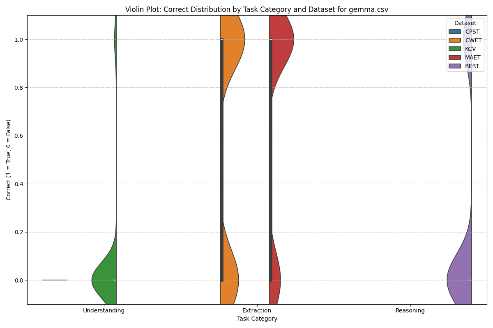
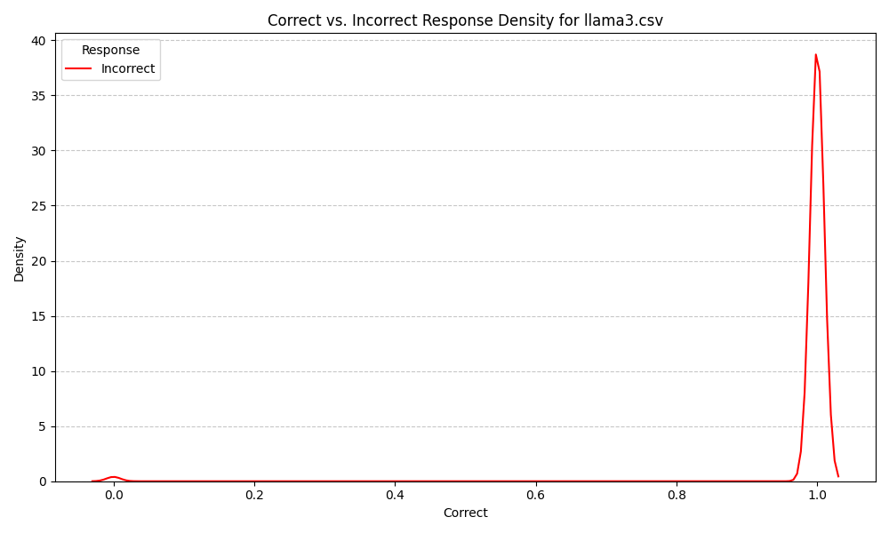

## Evaluating Security Guidance LLMs: A Benchmark Analysis

### Overview
The results from our benchmarking of several language models (LLMs) for security guidance reveal both promising insights and notable gaps. Using data from our repository at [LLM Security Guidance Benchmarks](https://github.com/davisconsultingservices/llm_security_guidance_benchmarks), we compared multiple models across tasks categorized into Understanding, Extraction, and Reasoning. Despite the hope for high-performing models in this critical domain, the findings highlight areas for improvement and potential future directions.


_To highlight the differences in model performance, we created a grouped bar chart comparing mean accuracies across task categories. A logarithmic scale was used for better visibility of relative performance differences, especially given the significant gap between Gemma and the other models._

### Key Insights

#### Performance Observations
1. **Model Accuracy and Reliability:**
   - **Gemma** performed the best among the tested models, achieving consistently higher scores across tasks. However, its performance, while leading, still fell below what one would expect from an LLM specifically tailored for security guidance.
   
   - Models like **SecurityLLM**, **Llama3**, and **Llama2** often produced verbose responses filled with incorrect information. This lack of accuracy, especially in tasks requiring precise reasoning, significantly limits their applicability in high-stakes security contexts.
   

2. **Secondary Validation with GPT-4o:**
   - To ensure the robustness of the Reasoning Task (RERT) results, verbose responses were cross-validated using [analyze_rert_results.py](https://github.com/davisconsultingservices/llm_security_guidance_benchmarks/blob/main/scripts/analyze_rert_results.py) with ChatGPT-4o providing a second opinion. This validation highlighted discrepancies in the models' understanding and reasoning capabilities, emphasizing the importance of layered evaluations.

#### Personal Reflections
- It’s can be frustrating to see models such as SecurityLLM frequently offering incorrect information despite their marketing as specialized tools for cybersecurity.
- While Gemma's relative success is encouraging, the gap between its current performance and the ideal expectations for a "security-focused LLM" is undeniable.
- This process has underscored the urgent need for better tools in the domain of security guidance. I’m left wondering whether such models currently exist—and if not, whether building one might be the next logical step.

### Next Steps
1. **Expanding the Search:**
   - I am actively looking for more security-oriented LLMs to test against this benchmark.
2. **Possibility of Developing a New Model:**
   - If existing solutions fail to meet expectations, building a tailored security guidance LLM from the ground up may be a worthwhile endeavor.

### Data

All plots can be found in the [result/plots directory](plots/)
All csv's can be found in the [results directory](.)
All scripts can be found in the [scripts directory](../scripts)

### Runtime Environment

All tests and benchmarks were conducted on **Google Colab**, leveraging an **NVIDIA A100 Tensor Core GPU**. This high-performance setup allows for efficient evaluation of large language models and reduces the time required for processing large datasets. Key environment details:

- **GPU**: NVIDIA A100 Tensor Core (40GB memory)
- **Frameworks**: 
  - PyTorch with CUDA support
  - Transformers library for model evaluation
- **Runtime Configuration**:
  - Python 3.x
  - Batch processing with iterative result saving for long-running tasks

---


### Conclusion
This benchmarking exercise provides valuable insights into the current capabilities and limitations of LLMs for security guidance. While some models show promise, the field remains in its infancy, with significant room for growth. As security professionals, we must demand higher accuracy and reliability from these tools and contribute to their development if necessary.

For detailed data and analysis scripts, visit the repository: [LLM Security Guidance Benchmarks](https://github.com/davisconsultingservices/llm_security_guidance_benchmarks).

---

### Notes

1) rert reporting for the dlite model had no output as the model could not read the input columns.
```
Token indices sequence length is longer than the specified maximum sequence length for this model (2140 > 1024). Running this sequence through the model will result in indexing errors
```

2) rert testing for the securityllm, llama3 and llama2 models were stopped short when it was obvious their output was always repeatively wrong (after some hundres of iterations)

e.g.
```
3.2.2 Path Traversal CWE-22 There are multiple ways in LAquis SCADA for an attacker to access locations outside of their own directory. CVE-2024-5041 has been assigned to this vulnerability. A CVSS v3.1 base score of 7.8 has been calculated; the CVSS vector string is (AV:L/AC:L/PR:N/UI:R/S:U/C:H/I:H/A:H). A CVSS v4 score has also been calculated for CVE-2024-5041. A base score of 8.5 has been calculated; the CVSS vector string is (CVSS4.0/AV:L/AC:L/AT:N/PR:N/UI:P/VC:H/VI:H/VA:H/WA:H/C:H/I:H/A:H). 3.2.3 Path Traversal CWE-22 There are multiple ways in LAquis SCADA for an attacker to access locations outside of their own directory. CVE-2024-5042 has been assigned to this vulnerability. A CVSS v3.1 base score of 7.8 has been calculated; the CVSS vector string is...
```